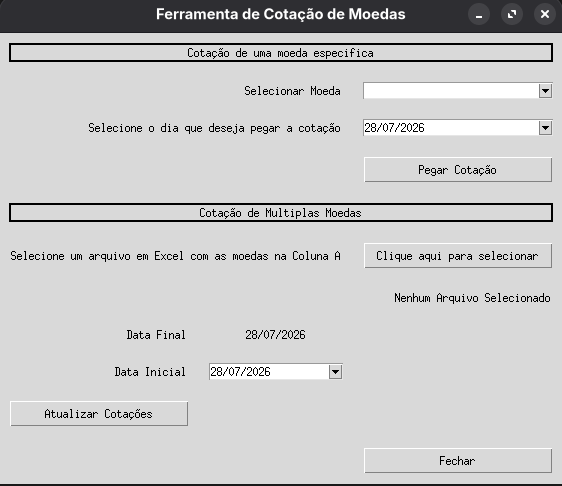
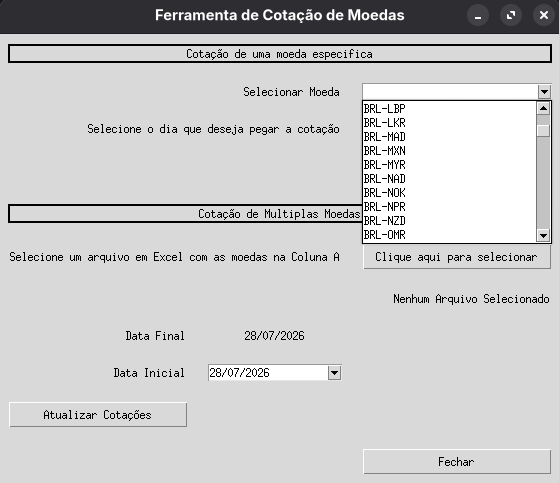
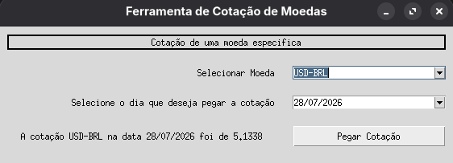
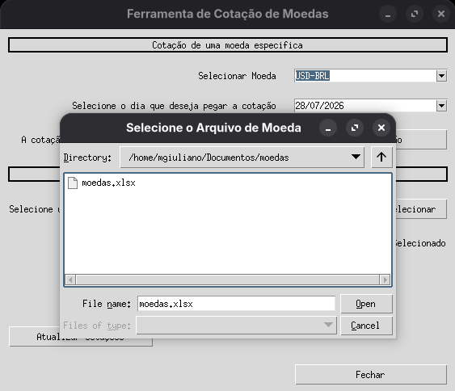
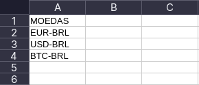
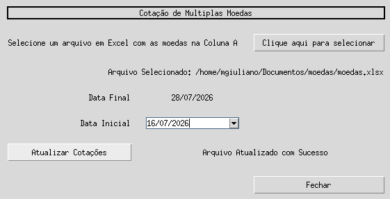
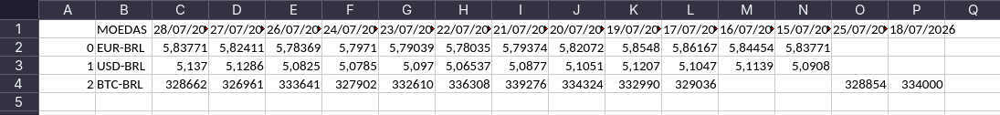
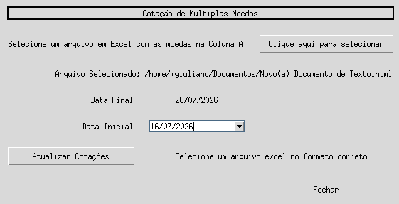

# ExchangePilot

A desktop application developed with **Python** and **Tkinter** that retrieves current and historical exchange rates using the **AwesomeAPI**. The application allows users to query a specific currency on a selected date or automatically update multiple exchange rates from an Excel spreadsheet.

---

# 🚀 Features

* 💱 Retrieve the exchange rate of a specific currency
* 📅 Search historical exchange rates by date
* 📂 Import Excel spreadsheets containing multiple currencies
* 📈 Automatically update exchange rates for all listed currencies
* 💾 Export the updated spreadsheet
* ⚠️ Input validation and user-friendly error handling
* 🖥️ Desktop graphical interface built with Tkinter

---

# 🛠️ Technologies

* Python 3
* Tkinter
* Pandas
* NumPy
* HTTPX
* tkcalendar
* AwesomeAPI
* OpenPyXL
* uv

---

# 📂 Project Structure

```text
ExchangePilot/
│
├── app/
│   ├── __init__.py
│   └── app.py                  # Main application
│
├── services/
│   ├── __init__.py
│   └── services.py             # AwesomeAPI integration
│
├── dataset/
│   └── README.md               # Excel files directory
│
├── images/
│   ├── escolhendo_arquivo.png
│   ├── escolhendo_moeda.png
│   ├── janela_completa.png
│   ├── mensagem_cotacao.png
│   ├── mensagem_erro.png
│   ├── mensagem_sucesso.png
│   ├── tabela_atualizada.png
│   └── tabela_original.png
│
├── .gitignore
├── .python-version
├── LICENSE
├── pyproject.toml
├── README.md
├── requirements.txt
└── uv.lock
```

---

# 📷 Screenshots

## 🖥️ Application Interface

Complete view of the desktop application and its available features.



---

## 💱 Selecting a Currency

Choose one of the currencies provided by the AwesomeAPI.



---

## 📈 Exchange Rate Result

Displays the exchange rate returned by the API for the selected date.



---

## 📂 Selecting an Excel File

Import an Excel spreadsheet containing the currencies to be updated.



---

## 📊 Original Spreadsheet

Initial spreadsheet before the exchange rate update.



---

## ✅ Successful Update

Confirmation message after updating all exchange rates.



---

## 📑 Updated Spreadsheet

Spreadsheet automatically updated with new exchange rate columns and values.



---

## ⚠️ Error Handling

Validation message displayed when an invalid Excel file is selected.



---

# ⚙️ Installation

Clone the repository:

```bash
git clone https://github.com/ZeniteOps/ExchangePilot.git
```

Enter the project folder:

```bash
cd ExchangePilot
```

Install the dependencies:

```bash
uv sync
```

Or, if you prefer pip:

```bash
pip install -r requirements.txt
```

---

# ▶️ Running the Application

Run the project from the root directory:

```bash
uv run python -m app.app
```

Or:

```bash
python -m app.app
```

---

# 🌐 API

This project uses the **AwesomeAPI** to retrieve exchange rate data.

Main endpoints:

* Available currencies
* Historical exchange rates

---

# 📈 Workflow

1. Select a currency to retrieve a single exchange rate.
2. Or import an Excel spreadsheet containing multiple currencies.
3. Choose the starting date.
4. The application downloads all available exchange rates.
5. The spreadsheet is automatically updated.
6. Save and use the generated file.

---

# 🔒 Error Handling

The application validates:

* Invalid Excel files
* Invalid dates
* HTTP request failures
* API communication errors
* Spreadsheet update issues

---

# 📄 License

This project is licensed under the MIT License.

---

# 👨‍💻 Author

**Matheus Giuliano**

GitHub: https://github.com/ZeniteOps

LinkedIn: https://www.linkedin.com/in/magiuliano/
